# Calibration architecture and data flow

```mermaid
flowchart LR
    A[Dataset registry and locked revision] --> B[Canonical adapter]
    C[OpenRouter catalog snapshot] --> D[Eligibility and panel lock]
    B --> E[Resolved manifest and durable queue]
    D --> E
    E --> F[Budget reservation and provider routing]
    F --> G[Redacted artifact store]
    G --> H[Scores and provenance in SQLite]
    H --> I[Immutable Parquet exports]
    I --> J[Fit and held-out diagnostics]
    J --> K[Calibration card and scenario diff]
    K --> L{Explicit promotion review}
    L -->|approved| M[Immutable profile and generated application artifacts]
    L -->|rejected| N[Candidate retained, no active change]
    M --> O[Append-only promotion history]
    O --> P[Rollback to previous immutable hash]
```

Operational signals are emitted from the queue and provider transport boundary:
queue depth, throughput, retries, errors, latency, tokens, cache hits, missing cells,
estimated/actual cost, model availability, and heartbeat age. Budget events are
reserved before paid requests and settled only after the provider response.
